<div align="center">
  
</div>

<div align="center">

[](https://github.com/prime3436)

</div>

---


### About Me

I'm an AI & Data Science engineer from Chennai, India — focused on building systems that are actually useful. My work spans computer vision, NLP, LLMs, and full-stack mobile apps.

I don't just build demos — I build things that work, perform, and ship.

```python
profile = {
    "name"     : "Patibandla Mohan Sai",
    "location" : "Chennai, India 🇮🇳",
    "degree"   : "B.Tech AI & Data Science",
    "current"  : ["Flutter", "Spring Boot", "LLMs", "Cloud Native"],
    "focus"    : "AI systems that are fast, useful, and offline-first",
}
```

<br clear="right"/>

---

### Tech Stack

<div align="center">

**Languages**


**AI / ML**


**Frameworks & Tools**


</div>

---

### Featured Projects

| Project | What it does | Stack |
|---------|-------------|-------|
| **🧠 Mental Health Detection** | Detects mental health signals from social media posts — >80% accuracy, >90% precision/recall. Published in TIJER, presented at international conference. | NLP · Sentiment Analysis · Text Classification |
| **👁️ FindX** | Language-driven video scene search. 40%+ recall improvement over baseline, 70% reduction in manual review time. | Computer Vision · PyTorch · Deep Learning |
| **🤟 SIGN-LESS** | AI communication tool for non-verbal individuals — no sign language required. | Speech Recognition · Sentiment Analysis · TTS |
| **📚 Lecture Summarizer** | Extracts keyframes from lecture videos and generates structured summaries using RAG + LLMs. | Clustering · LLMs · RAG · Generative AI |
| **🥗 YoTrackez** | Offline nutrition tracker — scan food with your camera, get macros instantly. Runs fully on-device. | Flutter · MobileNet V2 · SQLite |

---

### Achievements

<div align="center">

| | |
|---|---|
| 📰 **Published Researcher** | TIJER — The International Journal of Engineering Research |
| 🎤 **International Speaker** | 8th International Conference on Intelligent Computing |
| 🏅 **Oracle Certified** | OCI Generative AI Professional 2024 |
| 📚 **Multi-Certified** | TCS ION · NASSCOM Data Science · Google AI Essentials |
| 📊 **8.14 CGPA** | B.Tech AI & Data Science — Panimalar Engineering College |

</div>

---

### GitHub Stats

<div align="center">

[](https://github.com/prime3436)
[](https://github.com/prime3436)

[](https://github.com/prime3436)

[](https://github.com/prime3436)

[](https://github.com/prime3436)

</div>

---

### Connect

<div align="center">

[](mailto:mohansai3437@gmail.com)
[](https://www.linkedin.com/in/patibandla-mohan-sai-2ab988245/)
[](https://github.com/prime3436)


</div>

[](https://github.com/prime3436)
